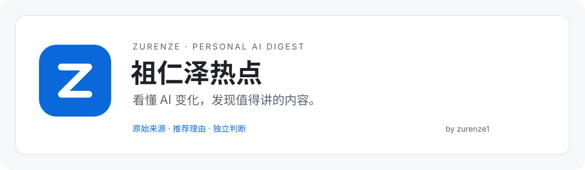

# Zurenze Hot · 祖仁泽热点

A personal AI news project by [祖仁泽 (zurenze1)](https://github.com/zurenze1), built on the [AIHOT open-source framework](https://github.com/KKKKhazix/AIHOT).

This version adds personal branding, a custom Z icon, blue light and dark themes, a homepage introduction and author information. The daily edition is configured for 09:00 Beijing time.

The collection, selection, grouping and publication engine remains the upstream implementation. Live collection and publication require deployment, a database, sources and a model provider. Douyin, Xiaohongshu and podcast collection are not turnkey features. The daily Codex chat automation is separate from this repository.

See the [Chinese README](README.md) for setup, the [deployment guide](docs/deploy.md) for hosting, and [the original upstream README](README.upstream.md) for framework details.

The original [MIT License](LICENSE) and [third-party notices](NOTICE) are preserved. News content belongs to its original publishers.
